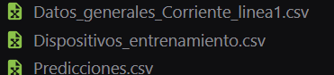

# Proyecto de Segregación de Datos

## Estructura de Carpetas Requeridas para la Segregación

A continuación se describen las carpetas necesarias para realizar el proceso de segregación:

 <!-- Asegúrate de cambiar la ruta y el nombre del archivo de imagen según corresponda -->

1. **Datos Generales**: En esta carpeta se almacenan las mediciones generales de los dispositivos.
   
2. **Dispositivos**: Aquí se guardan las mediciones específicas de cada dispositivo, las cuales se utilizarán para el entrenamiento.

3. **Dispositivos CSV**: Esta carpeta está destinada a la concatenación de nuestros archivos `.txt` a formato `.csv`. Inicialmente, estará vacía.

4. **Dispositivos de Entrenamiento**: Contiene los datos ya procesados para facilitar su manipulación durante el entrenamiento. Esta carpeta también comenzará vacía.

Al ejecutar los códigos correspondientes, las carpetas mencionadas generarán archivos automáticamente:

 <!-- Cambia esta ruta y nombre también -->

Además, se crearán archivos en la raíz del proyecto, los cuales se detallan a continuación

 <!-- Cambia esta ruta y nombre también -->
## Restablecimiento de Datos

Para restablecer todo el sistema, simplemente ejecuta el siguiente código:

 <!-- Cambia esta ruta y nombre también -->

## Carpeta de Manipulación
Esta carpeta está diseñada para realizar tareas específicas sobre los datos. Permitirá ejecutar funciones como:

1. Filtrar Datos por Rango de Fecha: Selecciona y visualiza datos dentro de un rango temporal determinado.
2. Visualización Detallada: Proporciona herramientas para crear gráficos y representar visualmente cada variable, facilitando así el análisis y la comprensión de los datos.

 <!-- Cambia esta ruta y nombre también -->

